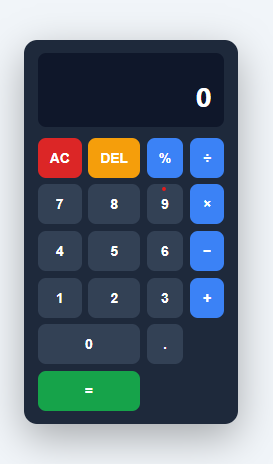

# 🧮 Modern Calculator Web App

A clean and responsive **Calculator Web Application** built using **HTML, CSS, and Vanilla JavaScript**.  
This project demonstrates core JavaScript concepts such as **DOM manipulation, event handling, keyboard support, and state management**.

The calculator performs basic arithmetic operations and provides a modern, interactive user interface.

---

## 🚀 Features

- ➕ Addition
- ➖ Subtraction
- ✖ Multiplication
- ➗ Division
- % Modulus operation
- 🧹 Clear all inputs (AC button)
- ⌫ Delete last digit (DEL button)
- ⌨️ Keyboard input support
- ❌ Division-by-zero error handling
- 🔢 Prevents multiple decimal points
- 📱 Responsive modern UI
- 🎨 Smooth button animations

---

## 🛠️ Technologies Used

- **HTML5** – Structure of the calculator
- **CSS3** – Styling and layout (Flexbox + Grid)
- **JavaScript (ES6)** – Calculator functionality and logic

---

## 📂 Project Structure

```
calculator/
│
├── index.html
├── script.js
└── README.md
```

---

## ⚙️ How the Calculator Works

The calculator uses **three main state variables**:

| Variable | Description |
|--------|-------------|
| `currentInput` | The number currently being typed |
| `previousInput` | The stored number before selecting an operator |
| `operator` | The selected arithmetic operation |

### Example

```
User Input: 7 + 3

Step 1: currentInput = 7
Step 2: operator = +
Step 3: previousInput = 7
Step 4: currentInput = 3
Step 5: Result = 10
```

---

## ⌨️ Keyboard Support

| Key | Action |
|----|----|
| `0 - 9` | Enter numbers |
| `.` | Decimal |
| `+` | Addition |
| `-` | Subtraction |
| `*` | Multiplication |
| `/` | Division |
| `Enter` or `=` | Calculate result |
| `Backspace` | Delete last digit |
| `Escape` | Clear calculator |

---

## 📸 Preview



---

## 🌐 Live Demo

You can deploy this project using **GitHub Pages**.

Example:

```
https://your-username.github.io/calculator
```

---

## 💡 Future Improvements

- Scientific calculator functions
- Calculation history
- Dark / Light mode toggle
- Advanced mathematical operations
- Mobile UI enhancements

---

